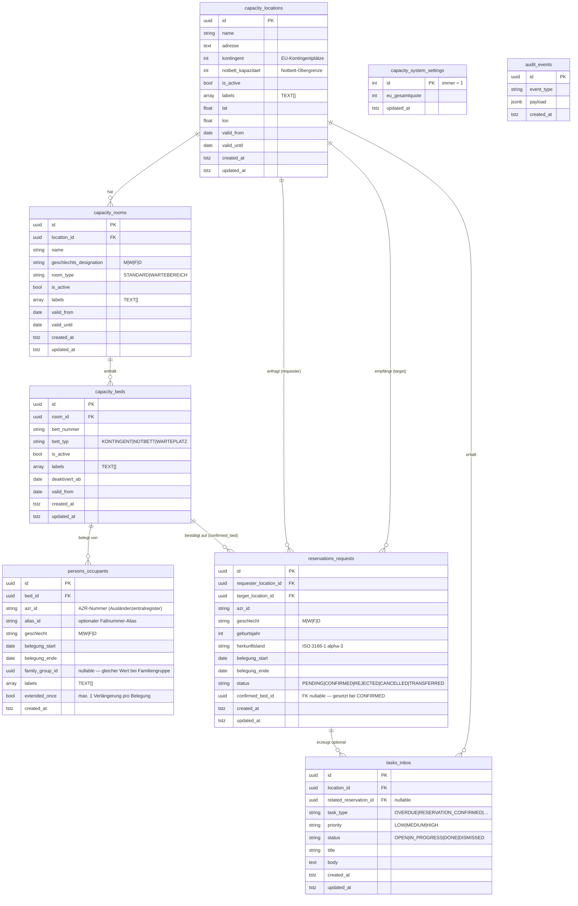

# BorderCapControl — Datenbankmodell

## Übersicht

Die Datenbank ist in **6 fachliche PostgreSQL-Schemata** aufgeteilt. Jedes Schema kapselt
eine Bounded-Context-Domäne und hat eigene Zugriffsrechte. Die Trennung verhindert
ungewollte Cross-Domain-Joins und macht Compliance-Anforderungen (Audit-Manipulationsschutz)
technisch durchsetzbar.

| Schema | Zweck | Schreibrecht `app_role` |
|--------|-------|------------------------|
| `capacity` | Einrichtungen, Räume, Betten, Systemeinstellungen | SELECT, INSERT, UPDATE, DELETE |
| `persons` | Belegungen (Personendaten) | SELECT, INSERT, UPDATE, DELETE |
| `reservations` | Verlegungsanfragen zwischen Einrichtungen | SELECT, INSERT, UPDATE, DELETE |
| `tasks` | Postkorb-Aufgaben (Task Inbox) | SELECT, INSERT, UPDATE, DELETE |
| `audit` | Unveränderliches Ereignisprotokoll | **INSERT only** — kein UPDATE/DELETE |
| `reference_data` | Codelisten (aktuell über SKOS-Service, nicht in DB) | SELECT, INSERT, UPDATE, DELETE |

---

## Entity-Relationship-Diagramm



---

## Schema-Details und Designentscheidungen

### `capacity` — Strukturdaten der Einrichtungen

#### `capacity.locations`

Zentrale Einrichtungstabelle. Jede Einrichtung (z.B. "Flughafen Frankfurt") ist ein
eigenständiger Mandant im System.

| Spalte | Typ | Bedeutung |
|--------|-----|-----------|
| `id` | UUID | Primärschlüssel — wird als `location_id` in Keycloak-Attributen referenziert |
| `kontingent` | INT | Anzahl EU-Kontingentplätze der Einrichtung |
| `notbett_kapazitaet` | INT | Maximale Anzahl Notbetten (temporäre Überkapazität) |
| `is_active` | BOOL | Soft-Delete — inaktive Einrichtungen erscheinen nicht in der UI |
| `labels` | TEXT[] | Einrichtungs-Hinweise (s. Label-System) |
| `lat` / `lon` | FLOAT | GPS-Koordinaten für Kartenansicht |
| `valid_from` / `valid_until` | DATE | Gültigkeitszeitraum der Einrichtung |

**Designentscheidung:** `kontingent` ist eine Zahl auf der Einrichtung, nicht auf
einzelnen Betten. EU-Quote wird global in `system_settings.eu_gesamtquote` geführt.
Die Betten mit `bett_typ = 'KONTINGENT'` zählen gegen das Kontingent, Notbetten separat.

---

#### `capacity.rooms`

Räume innerhalb einer Einrichtung. Primär für Geschlechter-Segregation.

| Spalte | Typ | Bedeutung |
|--------|-----|-----------|
| `geschlechts_designation` | VARCHAR(10) | `M` Männer · `W` Frauen · `F` Familie · `D` Divers |
| `room_type` | VARCHAR(20) | `STANDARD` — normaler Wohnraum · `WARTEBEREICH` — Wartebereich (s.u.) |
| `is_active` | BOOL | Soft-Delete |
| `labels` | TEXT[] | Raum-Hinweise (s. Label-System) |
| `valid_from` / `valid_until` | DATE | Planungszeitraum (z.B. saisonale Öffnung) |

**Designentscheidung:** Räume haben keine direkten Personenbezüge. Die Zuordnung
läuft über `beds → occupants`. So können Betten flexibel umgezogen werden.

**Wartebereich (`room_type = 'WARTEBEREICH'`):** Jede Einrichtung legt einen speziellen
Wartebereich-Raum an. Hier werden Neuankömmlinge temporär platziert, solange noch
kein festes Kontingent- oder Notbett zugewiesen ist. Die Plätze im Wartebereich
(„Warteplätze", `bett_typ = 'WARTEPLATZ'`) zählen **nicht** gegen das EU-Kontingent
und erscheinen **nicht** als Zieloption in Verlegungsanfragen. Sobald eine Person ein
festes Bett erhält, wird der Warteplatz freigegeben.

---

#### `capacity.beds`

Atomare Belegungseinheit. Jede Belegung hängt an genau einem Bett.

| Spalte | Typ | Bedeutung |
|--------|-----|-----------|
| `bett_typ` | VARCHAR(20) | `KONTINGENT` — zählt gegen EU-Quote · `NOTBETT` — temporäre Überkapazität · `WARTEPLATZ` — Platz im Wartebereich |
| `bett_nummer` | VARCHAR(50) | Freitext-Label (z.B. "A-01", "Oben links") |
| `deaktiviert_ab` | DATE | Geplantes Deaktivierungsdatum |
| `valid_from` | DATE | Ab wann das Bett verfügbar ist |
| `labels` | TEXT[] | Bett-Hinweise (s. Label-System) |

**Designentscheidung:** Die Trennung `KONTINGENT` / `NOTBETT` / `WARTEPLATZ` ist eine
fachliche Anforderung aus dem GEAS-Rahmenwerk. Notbetten dürfen max. 1 Tag belegt werden
(Domainregel in `capacity/rules.py`). Warteplätze gehören immer zu einem Raum mit
`room_type = 'WARTEBEREICH'` und werden beim Anlegen über die Stammdatenpflege automatisch
mit dem korrekten Typ versehen.

---

#### `capacity.system_settings`

Singleton-Tabelle (immer genau eine Zeile mit `id = 1`).

| Spalte | Bedeutung |
|--------|-----------|
| `eu_gesamtquote` | Gesamt-EU-Aufnahmekontingent für alle Einrichtungen zusammen |

**Designentscheidung:** Singleton statt Config-Datei, damit die Quote über die API
änderbar ist und Änderungen nachvollziehbar bleiben.

---

### `persons` — Belegungsdaten

#### `persons.occupants`

Kernverbindung zwischen Person und Bett. Enthält minimale, zweckgebundene Personendaten.

| Spalte | Typ | Bedeutung |
|--------|-----|-----------|
| `azr_id` | VARCHAR(50) | AZR-Nummer (Ausländerzentralregister) — Primäridentifikator |
| `alias_id` | VARCHAR(100) | Optionaler Fallnummer-Alias (z.B. für BAMF-interne Referenzen) |
| `geschlecht` | VARCHAR(10) | `M` · `W` · `F` (Familie) · `D` (Divers) |
| `belegung_start` / `belegung_ende` | DATE | Gültigkeitszeitraum der Belegung |
| `family_group_id` | UUID (nullable) | Gemeinsamer UUID für Familienmitglieder — kein FK, nur Gruppierung |
| `extended_once` | BOOL | Ob die Belegung bereits einmal verlängert wurde (max. 1x erlaubt) |
| `labels` | TEXT[] | Belegungs-Hinweise (s. Label-System) |

**Designentscheidung:** Bewusst minimale Personendaten (DSGVO-Prinzip der
Datensparsamkeit). Keine Namen, keine Fotos, keine biometrischen Daten. Die AZR-ID
ist der einzige stabile Personenidentifikator im System.

`family_group_id` ist kein Foreign Key auf eine eigene Tabelle — die Gruppe entsteht
dynamisch durch Belegungen mit gleicher UUID. Das vereinfacht die Dateneingabe und
vermeidet eine weitere Tabelle für ein einfaches Gruppierungsmerkmal.

---

### `reservations` — Anfragenworkflow

#### `reservations.requests`

Anfragen einer Einrichtung an eine andere, eine Person aufzunehmen.

| Spalte | Typ | Bedeutung |
|--------|-----|-----------|
| `requester_location_id` | UUID FK | Einrichtung, die eine Person abgeben möchte |
| `target_location_id` | UUID FK | Einrichtung, die die Person aufnehmen soll |
| `status` | VARCHAR(20) | Zustandsautomat (s. unten) |
| `confirmed_bed_id` | UUID FK (nullable) | Wird gesetzt, wenn Ziel-Einrichtung ein konkretes Bett bestätigt |
| `herkunftsland` | CHAR(3) | ISO 3166-1 alpha-3 (z.B. `SYR`, `AFG`) |
| `geburtsjahr` | SMALLINT | Statt vollem Geburtsdatum (DSGVO-Sparsamkeit) |

**Status-Zustandsautomat** (Domainregel in `reservations/rules.py`):

```
PENDING ──→ CONFIRMED ──→ TRANSFERRED
        └─→ REJECTED
        └─→ CANCELLED
```

**Designentscheidung:** Zwei FK-Spalten auf `capacity.locations` (`requester` und `target`)
statt einer selbstreferenzierenden Beziehung. Das macht Abfragen ("alle Anfragen an meine
Einrichtung") direkt formulierbar ohne Self-Join.

---

### `tasks` — Postkorb

#### `tasks.inbox`

Aufgaben für Sachbearbeiter, generiert durch Systemereignisse oder manuell.

| Spalte | Typ | Bedeutung |
|--------|-----|-----------|
| `location_id` | UUID FK | Einrichtung, für die die Aufgabe gilt |
| `related_reservation_id` | UUID FK (nullable) | Verknüpfte Verlegungsanfrage |
| `task_type` | VARCHAR(50) | Art der Aufgabe (s. Wertelisten) |
| `priority` | VARCHAR(10) | `LOW` · `MEDIUM` · `HIGH` |
| `status` | VARCHAR(20) | `OPEN` · `IN_PROGRESS` · `DONE` · `DISMISSED` |

**task_type-Werte:**

| Wert | Erzeugt durch |
|------|--------------|
| `OVERDUE` | APScheduler-Job — Belegung überfällig |
| `RESERVATION_CONFIRMED` | Reservierungsworkflow — Bestätigung eingegangen |
| `RESERVATION_REJECTED` | Reservierungsworkflow — Ablehnung eingegangen |
| `CAPACITY_WARNING` | APScheduler-Job — Einrichtung > 80 % belegt |
| `SUGGESTION_REJECTED` | Belegungsvorschlag vom Nutzer abgelehnt |

**Designentscheidung:** Tasks sind an `location_id` gebunden, nicht an individuelle
Sachbearbeiter. Alle Benutzer einer Einrichtung sehen denselben Postkorb — das
entspricht dem Behörden-Workflow, wo Aufgaben an Stellen (nicht Personen) gehen.

---

### `audit` — Unveränderliches Ereignisprotokoll

#### `audit.events`

Append-only Protokoll aller sicherheitsrelevanten Ereignisse.

| Spalte | Typ | Bedeutung |
|--------|-----|-----------|
| `event_type` | VARCHAR(100) | Frei definierter Ereignistyp (z.B. `OCCUPANT_CREATED`) |
| `payload` | JSONB | Kontextdaten des Ereignisses (flexibles Schema) |

**Designentscheidung:** `app_role` hat nur INSERT-Recht, kein UPDATE/DELETE.
Damit ist das Audit-Log technisch gegen nachträgliche Manipulation geschützt.
Compliance-Abfragen laufen über eine separate `audit_role` mit SELECT-Recht.
JSONB statt fixer Spalten erlaubt verschiedene Ereignistypen ohne Schema-Migration.

---

## Das Label-System

### Wo Labels gespeichert sind

Labels sind `TEXT[]`-Spalten (PostgreSQL-Arrays) auf vier Tabellen:

| Tabelle | Spalte | Beispiel-Werte |
|---------|--------|----------------|
| `capacity.locations` | `labels` | `rollstuhlgerecht`, `erdgeschoss` |
| `capacity.rooms` | `labels` | `ruhig`, `familienraum`, `klimaanlage` |
| `capacity.beds` | `labels` | `unteres-bett`, `oberes-bett`, `kinderbett` |
| `persons.occupants` | `labels` | `kind`, `arabisch`, `halal`, `mobilitaet` |

### Designentscheidung: Array statt Normalisierung

Labels hätten als eigene Tabelle mit n:m-Beziehung modelliert werden können.
Bewusste Entscheidung dagegen:

- **Einfachheit:** Kein JOIN nötig für die häufigste Abfrage ("Zeig alle Labels eines Bettes")
- **Flexibilität:** Neue Label-Werte brauchen keine Schema-Migration
- **Performance:** PostgreSQL-Arrays sind index-fähig (`GIN`-Index) und direkt filterbar
- **Fachliche Bedeutung:** Labels sind Hinweise, keine Masterdaten — sie haben keinen
  eigenen Lebenszyklus und werden nie eigenständig verwaltet

### Fachliche Bedeutung der Label-Ebenen

```
Einrichtungs-Labels   — physische/organisatorische Eigenschaften der Einrichtung
Raum-Labels           — Ausstattung und Zugänglichkeit des Raumes
Bett-Labels           — physische Eigenschaften des einzelnen Bettes
Belegungs-Labels      — Hinweise zur belegten Person (DSGVO Art. 9 beachten!)
```

**Wichtig:** Labels sind **nicht verbindlich**, nicht AZR-relevant und erscheinen
nicht in offiziellen Berichten. Sie unterstützen den Sachbearbeiter bei der
Bett-Zuweisung, haben aber keine rechtliche Wirkung.

Belegungs-Labels können besondere Kategorien personenbezogener Daten enthalten
(z.B. `halal` → Hinweis auf Religionszugehörigkeit). Daher gilt DSGVO Art. 9 —
nur mit expliziter Einwilligung oder gesetzlicher Grundlage speichern.

---

## Wertelisten (Enums)

Diese Werte sind als Python-Enums in `backend/src/domain/` definiert und als
`VARCHAR`-Spalten in der DB gespeichert (kein nativer PostgreSQL-Enum-Typ, um
Migrationen bei Erweiterungen zu vermeiden).

### `GenderDesignation` (`capacity.rooms.geschlechts_designation`, `persons.occupants.geschlecht`)

| Wert | Bedeutung |
|------|-----------|
| `M` | Männlich |
| `W` | Weiblich |
| `F` | Familie (gemischt) |
| `D` | Divers |

### `BedType` (`capacity.beds.bett_typ`)

| Wert | Bedeutung |
|------|-----------|
| `KONTINGENT` | Reguläres Bett, zählt gegen EU-Kontingentquote |
| `NOTBETT` | Temporäres Notbett, max. 1 Tag Belegungsdauer |
| `WARTEPLATZ` | Platz im Wartebereich, zählt nicht gegen Kontingent |

### `ReservationStatus` (`reservations.requests.status`)

| Wert | Bedeutung |
|------|-----------|
| `PENDING` | Anfrage gestellt, wartet auf Entscheidung |
| `CONFIRMED` | Ziel-Einrichtung hat Bett bestätigt |
| `REJECTED` | Ziel-Einrichtung hat abgelehnt |
| `CANCELLED` | Anfrage zurückgezogen |
| `TRANSFERRED` | Person wurde tatsächlich verlegt (Abschluss) |

### `TaskStatus` (`tasks.inbox.status`)

| Wert | Bedeutung |
|------|-----------|
| `OPEN` | Neu, noch nicht bearbeitet |
| `IN_PROGRESS` | In Bearbeitung |
| `DONE` | Erledigt |
| `DISMISSED` | Verworfen ohne Bearbeitung |

### `TaskPriority` (`tasks.inbox.priority`)

| Wert | Sortierung |
|------|-----------|
| `HIGH` | Wird zuerst im Postkorb angezeigt |
| `MEDIUM` | Standard |
| `LOW` | Wird zuletzt angezeigt |

---

## Datenbankrollen und Grants

```
bordercap       Migrations-User (Alembic) — DDL-Rechte, erstellt Tabellen
app_role        Anwendungs-User — DML auf alle Schemata außer audit (INSERT only)
audit_role      Compliance-User — SELECT auf audit.events
```

Die Rollenstruktur folgt dem Principle of Least Privilege:
die laufende Anwendung kann das Audit-Log nur beschreiben, nie lesen oder ändern.

---

## Migrationshistorie

| Migration | Inhalt |
|-----------|--------|
| `0001` | Schemata registrieren (bereits in `init.sql` erstellt) |
| `0002` | Vollständige `capacity`-Tabellen (locations, rooms, beds, system_settings) |
| `0003` | `reservations.requests`, `tasks.inbox` |
| `0004` | `family_group_id` zu `persons.occupants` |
| `0005` | DELETE-Grant für `tasks.inbox` an `app_role` |
| `0006` | Labels (`TEXT[]`) auf rooms, beds, occupants |
| `0007` | Labels + Koordinaten + Gültigkeitsdaten auf locations |
| `0008` | `valid_from` / `valid_until` auf rooms und beds |
| `0009` | `extended_once` auf occupants, Notbett-Erweiterungslogik |
