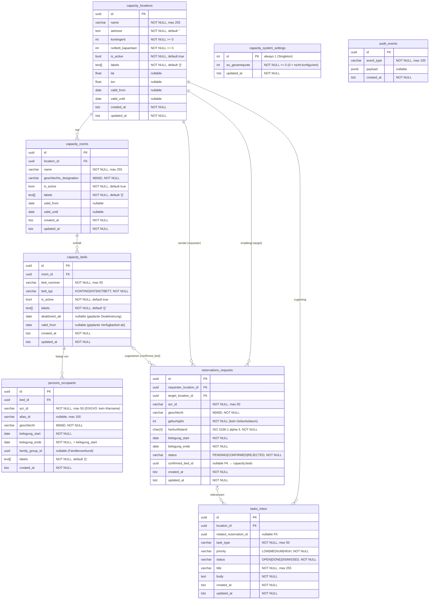

# BorderCapControl — Datendesign

**Version:** 1.0 · **Stand:** 2026-05-27  
**Status:** Maßgeblich — alle Schema-Änderungen müssen dieses Dokument aktualisieren.

---

## 1. Überblick

BorderCapControl nutzt **PostgreSQL 16** mit **6 fachlichen Schemata**. Das Datenmodell folgt **4NF** (Vierte Normalform): keine transitiven Abhängigkeiten, keine Mehrwert-Abhängigkeiten. Alle Entitäten besitzen UUID-Primärschlüssel, immutable Audit-Timestamps und keine physischen Löschungen (Soft-Delete via `is_active`).

### Schemata

| Schema           | Zweck                                              | Zugriff                          |
|------------------|----------------------------------------------------|----------------------------------|
| `capacity`       | Einrichtungen, Räume, Betten, Systemeinstellungen  | `app_role` (RW), `audit_role` (—)|
| `persons`        | Belegungen (DSGVO-minimal)                         | `app_role` (RW)                  |
| `reservations`   | Verlegungsanfragen zwischen Einrichtungen          | `app_role` (RW)                  |
| `tasks`          | Postkorb-Aufgaben / Notifications                  | `app_role` (RW)                  |
| `reference_data` | SKOS-Kataloge, Sprachcodes, Länderlisten           | `app_role` (R)                   |
| `audit`          | Unveränderliche Ereignislog-Einträge               | `app_role` (INSERT only)         |

---

## 2. ER-Diagramm



---

## 3. Tabellenbeschreibungen

### 3.1 `capacity.locations` — Einrichtungen

Repräsentiert eine Aufnahmeeinrichtung (z. B. Flughafen-Transit, Grenzübergang).

| Spalte               | Typ         | Beschreibung |
|----------------------|-------------|--------------|
| `id`                 | `UUID`      | PK, immutable |
| `name`               | `VARCHAR(255)` | Anzeigename der Einrichtung |
| `adresse`            | `TEXT`      | Vollständige Postanschrift |
| `kontingent`         | `INTEGER`   | Zugewiesene Regelplätze (≥ 0) |
| `notbett_kapazitaet` | `INTEGER`   | Zugelassene Notbetten (≥ 0) |
| `is_active`          | `BOOLEAN`   | Soft-Delete-Flag |
| `labels`             | `TEXT[]`    | Klassifikationsmerkmale (Erstaufnahme, Barrierefrei, …) |
| `lat`, `lon`         | `FLOAT`     | WGS-84-Koordinaten für Kartenansicht |
| `valid_from`         | `DATE`      | Einrichtung operativ ab (nullable) |
| `valid_until`        | `DATE`      | Einrichtung inaktiv ab (nullable) |
| `created_at`         | `TIMESTAMPTZ` | Immutable, Systemzeitpunkt |
| `updated_at`         | `TIMESTAMPTZ` | Letzter Update |

**Constraints:**
- `kontingent >= 0`, `notbett_kapazitaet >= 0`
- Summe aller `kontingent` (aktive Einrichtungen) ≤ `system_settings.eu_gesamtquote` (wenn > 0)
- `valid_from < valid_until` wenn beide gesetzt

---

### 3.2 `capacity.rooms` — Räume

Zimmer oder Schlafsaal innerhalb einer Einrichtung. Geschlechtliche Zuweisung ist operativ (nicht fix).

| Spalte                    | Typ          | Beschreibung |
|---------------------------|--------------|--------------|
| `id`                      | `UUID`       | PK |
| `location_id`             | `UUID`       | FK → `capacity.locations` |
| `name`                    | `VARCHAR(255)` | z. B. „Raum A – Männer" |
| `geschlechts_designation` | `VARCHAR(10)` | `M` / `W` / `D` (Gemischt) |
| `is_active`               | `BOOLEAN`    | Soft-Delete |
| `labels`                  | `TEXT[]`     | z. B. Erdgeschoss, Rollstuhlgerecht |
| `valid_from`              | `DATE`       | Raum verfügbar ab |
| `valid_until`             | `DATE`       | Raum außer Betrieb ab |
| `created_at`              | `TIMESTAMPTZ` | Immutable |
| `updated_at`              | `TIMESTAMPTZ` | Letzter Update |

**Constraints:**
- `geschlechts_designation` ∈ {`M`, `W`, `D`}
- Ein Raum ohne Geschlechts-Label gilt als Gemischt (D)

---

### 3.3 `capacity.beds` — Betten

Atomare belegbare Einheit.

| Spalte           | Typ          | Beschreibung |
|------------------|--------------|--------------|
| `id`             | `UUID`       | PK |
| `room_id`        | `UUID`       | FK → `capacity.rooms` |
| `bett_nummer`    | `VARCHAR(50)` | Lokale Bezeichnung (1, 2, A, …) |
| `bett_typ`       | `VARCHAR(20)` | `KONTINGENT` \| `NOTBETT` |
| `is_active`      | `BOOLEAN`    | Soft-Delete |
| `labels`         | `TEXT[]`     | z. B. Unteres Bett, Einzelbett |
| `deaktiviert_ab` | `DATE`       | Geplante Deaktivierung (Alarm-Funktion) |
| `valid_from`     | `DATE`       | Bett erst ab Datum belegbar (z. B. Renovierung) |
| `created_at`     | `TIMESTAMPTZ` | Immutable |
| `updated_at`     | `TIMESTAMPTZ` | Letzter Update |

**Constraints:**
- `bett_typ` ∈ {`KONTINGENT`, `NOTBETT`}
- Notbetten zählen nicht gegen das `kontingent` der Einrichtung
- Notbetten dürfen maximal 1 Tag belegt werden (Domainregel)

---

### 3.4 `persons.occupants` — Belegungen

DSGVO-minimales Belegungsmodell. **Kein Klarname**, kein vollständiges Geburtsdatum.

| Spalte           | Typ          | Beschreibung |
|------------------|--------------|--------------|
| `id`             | `UUID`       | PK |
| `bed_id`         | `UUID`       | FK → `capacity.beds` |
| `azr_id`         | `VARCHAR(50)` | AZR-Nummer (eindeutiger Identifikator, kein Klarname) |
| `alias_id`       | `VARCHAR(100)` | Optionaler Zweitcode (z. B. Fallnummer) |
| `geschlecht`     | `VARCHAR(10)` | `M` / `W` / `D` |
| `belegung_start` | `DATE`       | Einzugsdatum |
| `belegung_ende`  | `DATE`       | Planmäßiges Auszugsdatum, > `belegung_start` |
| `family_group_id`| `UUID`       | Optionaler Familienverbund-Schlüssel |
| `labels`         | `TEXT[]`     | Operative Hinweise (Sprache, Schutzbedarf, …) |
| `created_at`     | `TIMESTAMPTZ` | Immutable (kein `updated_at` – Belegungen werden ersetzt, nicht geändert) |

**DSGVO-Prinzipien:**
- Kein Name, keine vollständige Adresse, kein Geburtsdatum (nur Jahrgang in Reservierungen)
- `azr_id` ist das AZR-Registriernummer — nicht im Klartext anzeigen
- Labels sind rein operative Hinweise, keine rechtlich bindenden Merkmale
- Belegungen werden bei Checkout oder Verlegung vollständig gelöscht (kein Soft-Delete)

**Constraints:**
- `belegung_ende > belegung_start`
- Zu einem Zeitpunkt darf ein Bett nur eine aktive Belegung haben (`belegung_start <= t < belegung_ende`)

---

### 3.5 `reservations.requests` — Verlegungsanfragen

Steuert den Verlegungsworkflow zwischen Einrichtungen.

| Spalte                    | Typ          | Beschreibung |
|---------------------------|--------------|--------------|
| `id`                      | `UUID`       | PK |
| `requester_location_id`   | `UUID`       | FK → anfragende Einrichtung |
| `target_location_id`      | `UUID`       | FK → Zieleinrichtung |
| `azr_id`                  | `VARCHAR(50)` | Zu verlegende Person |
| `geschlecht`              | `VARCHAR(10)` | `M` / `W` / `D` |
| `geburtsjahr`             | `SMALLINT`   | Jahrgang (kein vollst. Geburtsdatum) |
| `herkunftsland`           | `CHAR(3)`    | ISO 3166-1 alpha-3 |
| `belegung_start`          | `DATE`       | Gewünschter Einzug |
| `belegung_ende`           | `DATE`       | Gewünschter Auszug |
| `status`                  | `VARCHAR(20)` | `PENDING` → `CONFIRMED` \| `REJECTED` |
| `confirmed_bed_id`        | `UUID`       | FK → zugewiesenes Bett (bei CONFIRMED) |
| `created_at`              | `TIMESTAMPTZ` | Immutable |
| `updated_at`              | `TIMESTAMPTZ` | Letzter Statuswechsel |

**Workflow:**
```
PENDING → CONFIRMED (Zieleinrichtung weist Bett zu + legt Belegung an)
        → REJECTED  (Zieleinrichtung lehnt ab)
PENDING → RETRACTED (anfragende Einrichtung zieht zurück)
```

**Berechtigungen:**
- Stornieren (RETRACT): nur `requester_location_id` oder `system-admin`
- Bestätigen/Ablehnen: nur `target_location_id` oder `system-admin`
- Alle sehen: `system-admin`; eigene Ein- und Ausgänge: `loc-admin`

---

### 3.6 `tasks.inbox` — Postkorb-Aufgaben

Asynchrone Benachrichtigungen und Handlungsbedarfe.

| Spalte                    | Typ          | Beschreibung |
|---------------------------|--------------|--------------|
| `id`                      | `UUID`       | PK |
| `location_id`             | `UUID`       | FK → betroffene Einrichtung |
| `related_reservation_id`  | `UUID`       | nullable FK → Reservierungsanfrage |
| `task_type`               | `VARCHAR(50)` | `RESERVATION_RECEIVED`, `RESERVATION_CONFIRMED`, … |
| `priority`                | `VARCHAR(10)` | `LOW` / `MEDIUM` / `HIGH` |
| `status`                  | `VARCHAR(20)` | `OPEN` / `DONE` / `DISMISSED` |
| `title`                   | `VARCHAR(255)` | Kurztitel |
| `body`                    | `TEXT`       | Volltext der Aufgabe |
| `created_at`              | `TIMESTAMPTZ` | Immutable |
| `updated_at`              | `TIMESTAMPTZ` | Letzter Statuswechsel |

---

### 3.7 `capacity.system_settings` — Systemeinstellungen (Singleton)

| Spalte            | Typ          | Beschreibung |
|-------------------|--------------|--------------|
| `id`              | `INTEGER`    | PK, always 1 |
| `eu_gesamtquote`  | `INTEGER`    | EU-weite Gesamtkapazitätsgrenze (0 = inaktiv) |
| `updated_at`      | `TIMESTAMPTZ` | Letzter Update |

---

### 3.8 `audit.events` — Unveränderliches Audit-Log

| Spalte       | Typ          | Beschreibung |
|--------------|--------------|--------------|
| `id`         | `UUID`       | PK |
| `event_type` | `VARCHAR(100)` | z. B. `location.created`, `occupancy.checkout` |
| `payload`    | `JSONB`      | Kontextdaten (keine PII) |
| `created_at` | `TIMESTAMPTZ` | Immutable — kein UPDATE/DELETE für `app_role` |

**Sicherheit:** `app_role` hat ausschließlich `INSERT`-Recht — keine Manipulation möglich.

---

## 4. Normalisierung (4NF)

### 4.1 1NF — Atomare Attribute
Alle Werte sind atomar. Die einzige Ausnahme: `labels TEXT[]` ist bewusst denormalisiert, weil Labels operative Hinweise ohne eigene Schlüssel-Semantik sind (kein FK, keine Referenzintegrität). Sie sind funktional äquivalent zu einer `entity_labels`-Verknüpfungstabelle, aber für OLTP-Queries deutlich performanter.

### 4.2 2NF — Keine partiellen Abhängigkeiten
Alle Nicht-Schlüsselattribute hängen vollständig vom Primärschlüssel (UUID) ab. Es gibt keine zusammengesetzten Schlüssel.

### 4.3 3NF — Keine transitiven Abhängigkeiten
Kein Attribut hängt transitiv über ein anderes Nicht-Schlüsselattribut ab:
- `rooms.location_id` → `locations.kontingent` nicht in `rooms` repliziert
- `occupants` enthält keine abgeleiteten Aggregatwerte

### 4.4 4NF — Keine Mehrwert-Abhängigkeiten (BCNF+)
Eine Mehrwert-Abhängigkeit läge vor, wenn z. B. eine Tabelle `(bed_id, label, feature)` existierte, bei der `label` und `feature` unabhängig vom gleichen Schlüssel abhingen. Das wird durch `TEXT[]`-Arrays verhindert — Labels sind eine einzige mehwertige Eigenschaft, nicht zwei unabhängige.

**Bewusste Denormalisierungen (dokumentiert):**

| Ort | Abweichung | Begründung |
|-----|-----------|-----------|
| `*.labels TEXT[]` | Array statt Verknüpfungstabelle | Labels sind operationale Hinweise ohne Referenzintegrität; Array-GIN-Index ermöglicht `@>`-Suche in O(log n) |
| `reservations.requests.geburtsjahr` | Jahrgang statt DATE | DSGVO-Datensparsamkeit: kein vollständiges Geburtsdatum |
| `occupants` kein `updated_at` | Keine Mutations-History | Belegungen sind immutable — bei Änderung wird gelöscht und neu angelegt |

---

## 5. Indizes

```sql
-- GIN-Index für Array-Containment-Suche (@>)
CREATE INDEX idx_occupants_labels    ON persons.occupants     USING GIN (labels);
CREATE INDEX idx_rooms_labels        ON capacity.rooms        USING GIN (labels);
CREATE INDEX idx_beds_labels         ON capacity.beds         USING GIN (labels);
CREATE INDEX idx_locations_labels    ON capacity.locations    USING GIN (labels);

-- B-Tree für häufige Filter
CREATE INDEX idx_occupants_bed_id    ON persons.occupants     (bed_id);
CREATE INDEX idx_occupants_azr_id    ON persons.occupants     (azr_id);
CREATE INDEX idx_beds_room_id        ON capacity.beds         (room_id);
CREATE INDEX idx_rooms_location_id   ON capacity.rooms        (location_id);
CREATE INDEX idx_tasks_location_id   ON tasks.inbox           (location_id);
CREATE INDEX idx_reservations_status ON reservations.requests (status);
CREATE INDEX idx_reservations_target ON reservations.requests (target_location_id, status);
```

---

## 6. Datenzugriff & Rollen

### Datenbankrollen

| Rolle          | Rechte                                                        |
|---------------|---------------------------------------------------------------|
| `bordercap`   | Owner — DDL, Alembic-Migrationen                             |
| `app_role`    | DML auf allen Schemata außer `audit` (INSERT-only dort)       |
| `audit_role`  | SELECT auf `audit.events` (Compliance-Abfragen)               |
| `bordercap_app` | Applikations-Login, Mitglied von `app_role`                 |

### Applikations-Rollen (Keycloak)

| Rolle          | Beschreibung                              | location_id-Binding |
|---------------|-------------------------------------------|---------------------|
| `system-admin`| Vollzugriff auf alle Einrichtungen        | keines (null)       |
| `loc-admin`   | Vollzugriff auf eigene Einrichtung        | Ja                  |
| `reader`      | Lesezugriff auf zugewiesene Einrichtung   | Ja                  |

---

## 7. Datenintegrität — Wichtige Invarianten

1. **Doppelbelegung verhindern:** Zu jedem Zeitpunkt `t` darf `bed_id` in maximal einer Zeile von `occupants` vorkommen mit `belegung_start <= t < belegung_ende`. Wird durch Applikationslogik vor INSERT geprüft.

2. **Kontingentschutz:** `UPDATE capacity.locations SET kontingent = n` wird abgelehnt, wenn `n < aktuelle_belegung`. Wird im `update_location`-Endpoint geprüft.

3. **EU-Gesamtquote:** Summe aller `locations.kontingent` (is_active=true) darf `system_settings.eu_gesamtquote` nicht überschreiten (außer wenn `eu_gesamtquote = 0`).

4. **Notbett-Belegungsdauer:** Notbetten (`bett_typ = NOTBETT`) dürfen maximal 1 Tag belegt werden. Wird in `check_notbett_duration()` geprüft.

5. **Reservierungs-Stornierung:** Nur die anfragende Einrichtung oder `system-admin` darf eine `PENDING`-Anfrage zurückziehen.

6. **Audit-Unveränderlichkeit:** `audit.events` hat für `app_role` nur INSERT — kein UPDATE, DELETE. Manipulationsschutz auf DB-Ebene.

---

## 8. Migrations-Strategie

Schemaänderungen werden ausschließlich via **Alembic** durchgeführt:

```bash
# Neue Migration erstellen
docker compose exec backend alembic revision --autogenerate -m "add_xyz"

# Ausstehende Migrationen anwenden
make migrate
```

Die `infra/postgres/init.sql` erstellt nur Schemata und Placeholder-Tabellen für den Health-Check. Die eigentliche Tabellenstruktur wird vollständig von Alembic verwaltet.

**Migrations-Prinzipien:**
- Immer rückwärtskompatibel (kein DROP ohne Migration + Renames)
- Neue NOT-NULL-Spalten immer mit DEFAULT
- Indizes werden mit `CREATE INDEX CONCURRENTLY` hinzugefügt (kein Table-Lock)

---

## 9. Changelog

| Version | Datum      | Änderung |
|---------|-----------|---------|
| 1.0     | 2026-05-27 | Initiales Datendesign-Dokument |
